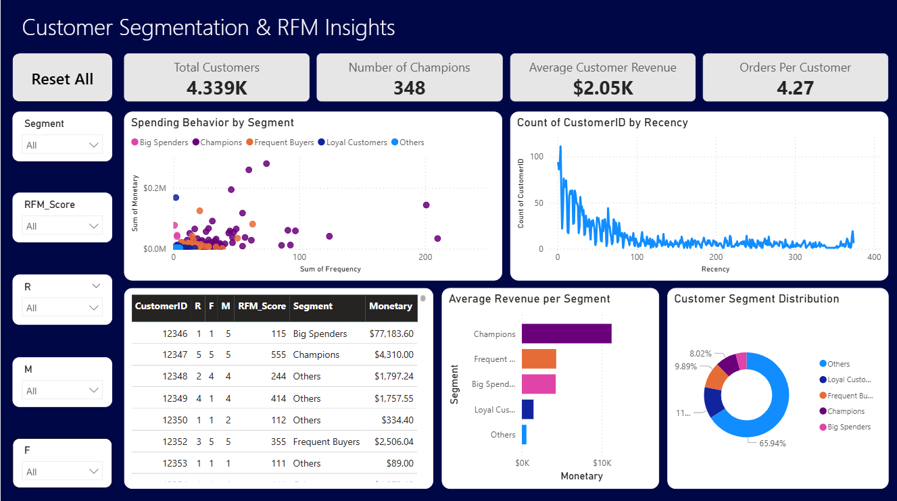

# Customer Segmentation with RFM Analysis

This project analyzes customer purchasing behavior using RFM (Recency, Frequency, Monetary) segmentation and visualizes insights with an interactive Power BI dashboard.

## Power BI Dashboard

The dashboard visualizes RFM results with:
  
  - KPI Cards – Total Customers, # Champions, Avg Spend, Orders per Customer
  
  - Donut Chart – Segment Breakdown
  
  - Scatter Plot – Frequency vs Monetary
  
  - Histogram – Recency Distribution
  
  - Bar Chart – Avg Revenue by Segment
  
  - Table – Drill-down with RFM scores
  
  - Slicers – Filter by Segment, RFM Score, R, F, M

## 🛠Tools Used
  
  - Python (Pandas,	Data cleaning and transformation)
  
  - VS Code	(Python script development environment)
  
  - Power BI	(Interactive dashboard and visualization)
  
  - CSV (Excel Intermediate data storage/export)
  
  - Git & GitHub	(Version control and project hosting)

## Dashboard Preview

## Files

  - `https://www.kaggle.com/datasets/carrie1/ecommerce-data` - Dataset Used
  
  - `rfm_dashboard.pbix` - Power BI file
  
  - `rfm_analysis.py` - Python file
  
  - `rfm_segments.csv` - CSV file
  
  - `rfm_dashboard.png` — Dashboard image preview
  
  - `README.md` – Project overview and guide

Sample sales dataset containing data:
> `InvoiceNo`, `StockCode`, `Description`, `Quantity`, `InvoiceDate`, `UnitPrice`, `CustomerID`, `Country`

## RFM Analysis

RFM metrics Calculated:

  - Recency: Days since last purchase
  
  - Frequency: Number of unique orders
  
  - Monetary: Total amount spent

Scored each RFM value on a scale of 1–5 and classified customers into segments:

### Segment	(Criteria)

  - Champions	(R=5, F=5, M=5)

  - Loyal Customers	(High R, medium/high F)

  - Frequent Buyers	(F=5)

  - Big Spenders	(M=5)

  - Others	(Remaining customers)

## Key Insights

  - Champions account for a significant share of total revenue.
  
  - Big Spenders shop less frequently but spend heavily.
  
  - Many customers haven’t purchased recently — target for re-engagement.
